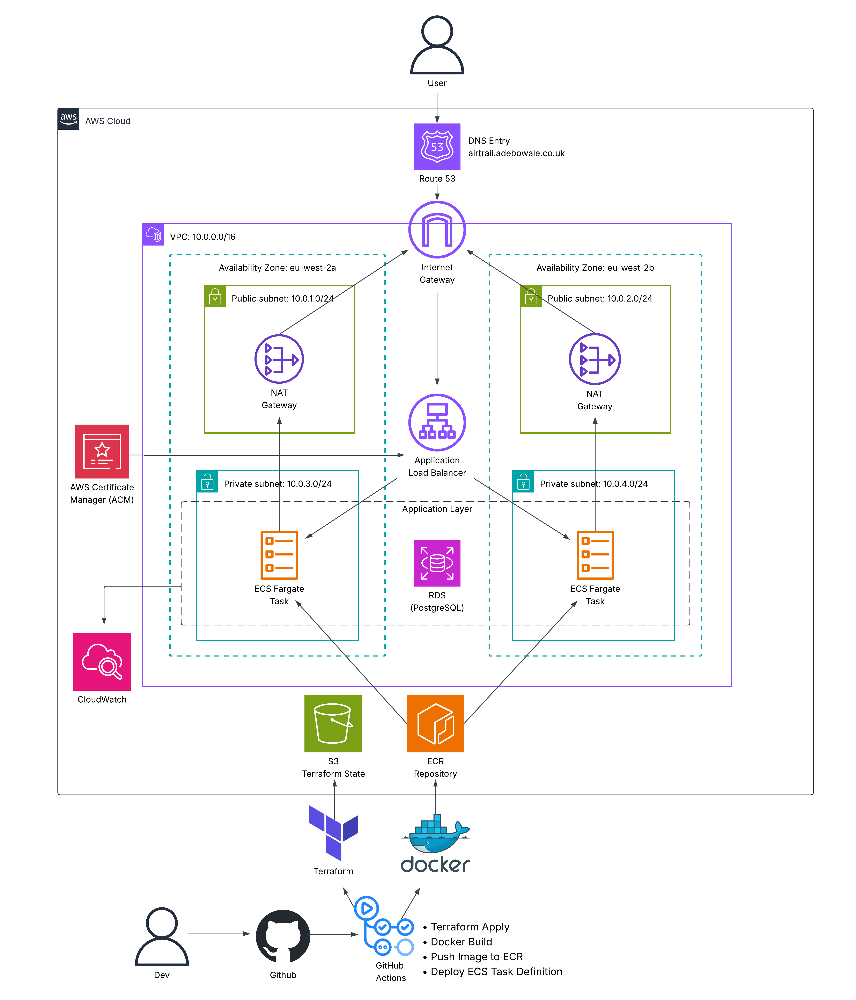
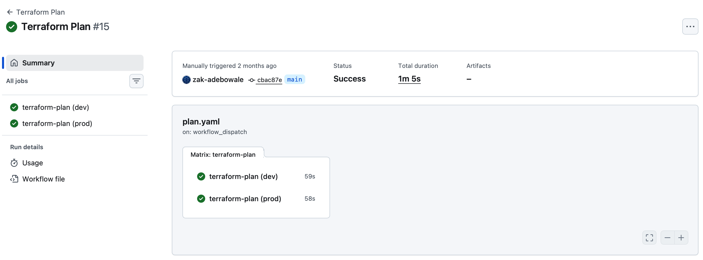
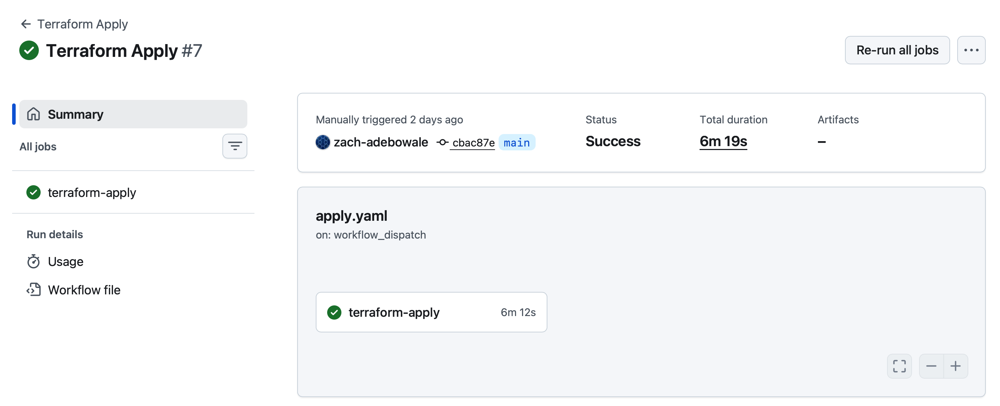
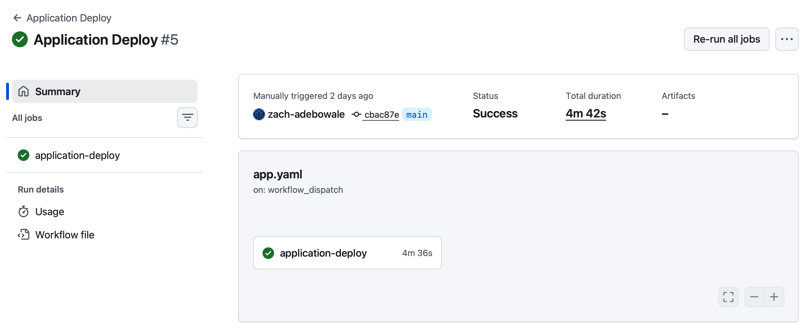
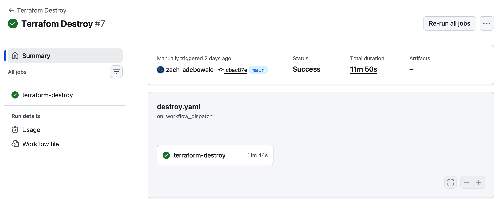

# AirTrail: Terraform & ECS Fargate Deployment

## Overview

This project takes AirTrail, an open-source flight tracker, and deploys it to AWS using Terraform, Docker, and GitHub Actions. Terraform provisions the infrastructure, Docker packages the app, and GitHub Actions automates deployment to ECS Fargate.

## Table of Contents

- [Overview](#overview)
- [Demo Walkthrough](#demo-walkthrough)
- [Architecture Diagram](#architecture-diagram)
- [Infrastructure Overview](#infrastructure-overview)
- [Project Structure](#project-structure)
- [CI/CD Pipelines](#cicd-pipelines)
- [Docker Image Optimisation](#docker-image-optimisation)
- [AWS Cost Estimate](#aws-cost-estimate)
- [Local Setup](#local-setup)
- [Technologies Used](#technologies-used)
- [Future Improvements](#future-improvements)

## Demo Walkthrough

Both environments running the app, deployed through plan, apply, and deploy.

Production:
https://airtrail.adebowale.co.uk

Development:
https://dev.airtrail.adebowale.co.uk

### What's shown below:

- HTTPS certificate provisioned using AWS ACM
- The app served through an Application Load Balancer
- Route53 DNS resolution
- ECS Fargate container deployment
- PostgreSQL database connectivity

[Demo]

### Health Endpoint

The app exposes a health check at `/api/ping`, which returns `pong`. Docker, ECS, and the app itself all use this to confirm the service is alive.

## Architecture Diagram

Full breakdown of the networking, app flow, and CI/CD pipeline below.




## Infrastructure Overview

| Component | Purpose |
| --- | --- |
| VPC | Provides isolated networking |
| Public Subnets | Host the Application Load Balancer |
| Private Subnets | Host ECS tasks and RDS |
| Internet Gateway | Internet connectivity |
| NAT Gateways | Outbound internet for private resources |
| ALB | HTTPS entry point and load balancing |
| ECS Fargate | Runs the app containers |
| RDS PostgreSQL | Persistent relational database |
| ECR | Stores Docker images |
| Route 53 | DNS resolution |
| ACM | TLS certificate management |
| CloudWatch | Centralised logging |
| Bootstrap | GitHub OIDC IAM resources |

## Project Structure

```
.
├── .env.example
├── .github/
│   └── workflows/
│       ├── app.yaml
│       ├── apply.yaml
│       ├── destroy.yaml
│       └── plan.yaml
├── .gitignore
├── README.md
├── app/
│   ├── .dockerignore
│   ├── Dockerfile
│   ├── bun.lock
│   ├── components.json
│   ├── data/
│   ├── docker/
│   ├── eslint.config.js
│   ├── package.json
│   ├── playwright.config.ts
│   ├── prisma/
│   ├── src/
│   ├── static/
│   ├── svelte.config.js
│   ├── tsconfig.json
│   └── vite.config.ts
├── bootstrap/
│   ├── main.tf
│   ├── outputs.tf
│   ├── provider.tf
│   └── variables.tf
├── docker-compose.yml
├── infra/
│   ├── .terraform.lock.hcl
│   ├── backend.tf
│   ├── envs/
│   │   ├── dev.tfvars
│   │   └── prod.tfvars
│   ├── main.tf
│   ├── modules/
│   │   ├── acm/
│   │   ├── alb/
│   │   ├── db/
│   │   ├── ecr/
│   │   ├── ecs/
│   │   ├── iam/
│   │   ├── route_53/
│   │   ├── security_groups/
│   │   └── vpc/
│   ├── outputs.tf
│   ├── provider.tf
│   ├── terraform.tfstate
│   ├── terraform.tfstate.backup
│   └── variables.tf
└── terraform.tfstate
```

## CI/CD Pipelines

CI/CD runs on GitHub Actions across four workflows: infrastructure validation, deployment, app delivery, and teardown. AWS authentication uses GitHub OIDC so there are no long lived AWS access keys sitting in secrets.

| Workflow | Category |
| --- | --- |
| Terraform Plan | CI |
| Terraform Apply | Infrastructure CD |
| Application Deploy | Application CD |
| Terraform Destroy | Infrastructure Lifecycle |

### Terraform Plan (CI)

#### Purpose 

Checks the Terraform configuration and generates a plan for dev and prod without touching real infrastructure.



### Terraform Apply (CD)

#### Purpose 

Provisions or updates AWS infrastructure for whichever environment triggered the run.



### Application Deploy (CD)

#### Purpose 

Builds the latest version of the app, pushes it to ECR, and deploys it to ECS Fargate.



### Terraform Destroy

#### Purpose 

Tears down infrastructure for a chosen environment when it's no longer needed.



## Docker Image Optimisation

I rebuilt the Docker image as a multi-stage build to cut deployment time. I also built a single-stage version for comparison, just to show what happens when build tools and dev dependencies end up in the runtime image.

| Dockerfile | Compressed Size | Notes |
|------------|----------------:|-------|
| Original AirTrail | 339 MB | Upstream project Dockerfile |
| Single stage build | 378 MB | Build tools and dev dependencies left in |
| Optimised multi-stage build | **152 MB** | 55% smaller than the original |

The optimised Dockerfile separates dependency installation, app compilation, and the production runtime into distinct stages. That cut the compressed image size from **339 MB** to **152 MB**, with no loss to the app's functionality, health checks, or entrypoint behaviour. 

The single-stage build exists purely for comparison, to show what happens when build tools and dev dependencies get left in the runtime image.

## AWS Cost Estimate

| Service | Dev | Prod | Notes |
|---|---:|---:|---|
| ECS Fargate | £13 | £51 | 1 task in dev, 2 tasks in prod |
| ALB | £18 | £18 | Fixed hourly cost |
| NAT Gateways (2) | £65 | £65 | One per AZ, biggest cost by far |
| RDS PostgreSQL | £13 | £18 | db.t3.micro, 20GB dev / 50GB prod |
| Route 53 | £1 | £1 | |
| ECR | <£1 | <£1 | |
| CloudWatch Logs | £1 | £3 | Depends on retention |
| ACM | Free | Free | |

**Dev total: £110/mo**

**Prod total: £155/mo**

## Local Setup

1. Clone the repository
2. Copy `.env.example` to `.env`
3. Run: `docker compose up --build`
4. Browse to: http://localhost

The Docker Compose environment starts the **AirTrail app** and **PostgreSQL database**.

## Technologies Used

| Category | Technologies |
| --- | --- |
| Cloud | AWS |
| Infrastructure | Terraform |
| Containerisation | Docker |
| Orchestration | Amazon ECS Fargate |
| CI/CD | GitHub Actions |
| Container Registry | Amazon ECR |
| Database | Amazon RDS for PostgreSQL |
| DNS | Amazon Route 53 |
| TLS | AWS Certificate Manager (ACM) |
| Logging | Amazon CloudWatch |
| Authentication | GitHub OIDC |
| App | AirTrail |

## Future Improvements
Potential improvements include:
- ECS Auto Scaling
- Secrets Manager
- WAF
- CloudFront
- Blue/Green Deployments
- RDS Multi-AZ Production
- Terraform Cloud
- GitHub Environments with approvals
- Monitoring dashboards